# Reversing Lab

권한을 보유한 ELF, PE, Mach-O 바이너리와 CTF/CrackMe를 분석하는 웹 기반 리버스
엔지니어링 워크벤치입니다. 정적 분석, 추정 C 유사 코드, CFG/Call Graph, 패킹·난독화
finding, 메모리 트리아지, 격리형 동적 분석 제어, CTF 노트와 보고서를 한 화면에서 다룹니다.

> 승인받지 않은 침해, 자격 증명 탈취, 악성코드 배포, DRM 우회 자동화 또는 실제 서비스
> 공격을 위한 도구가 아닙니다. 소유하거나 분석 권한을 받은 샘플에만 사용하십시오.


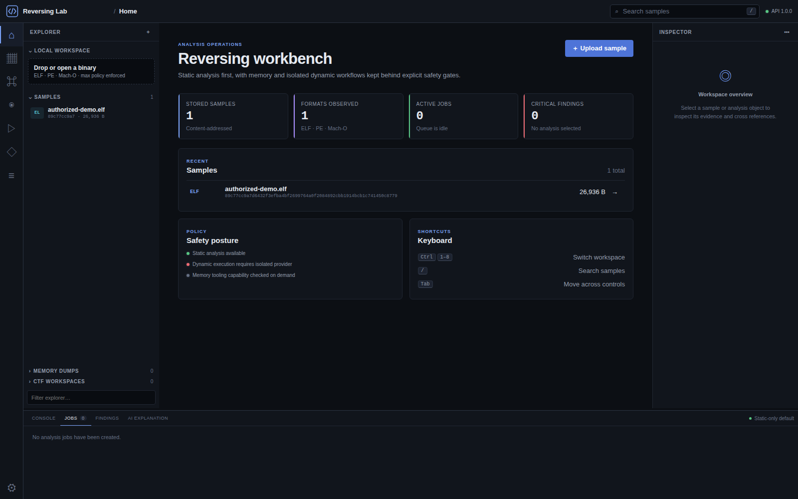

## 빠른 시작

가장 간단한 방법은 Docker Compose입니다.

```bash
git clone https://github.com/MintKangaroo/Reversing_Lab.git
cd Reversing_Lab
docker compose up --build
```

- UI: http://127.0.0.1:5173
- API 문서: http://127.0.0.1:8000/docs
- 상태 확인: http://127.0.0.1:8000/api/health

이 Compose 구성은 개발 환경이며 악성코드 실행 sandbox가 아닙니다.

## 사용 방법

1. 왼쪽 Explorer에서 분석 권한이 있는 ELF/PE/Mach-O 파일을 업로드합니다.
2. `Functions`에서 함수를 선택하고 `Disassembly`, `Pseudo-C`, `CFG`를 확인합니다.
3. `Call Graph`, `Program Flow`, `Packing`, `Obfuscation`에서 근거와 confidence를 검토합니다.
4. 오른쪽 Inspector에 함수 이름, 코멘트와 bookmark를 기록합니다.
5. `Reports`에서 JSON, Markdown 또는 HTML 보고서를 내려받습니다.
6. `Settings`에서 최근 변경 감사 기록을 JSONL로 내보내거나 내 데이터 정리 dry-run을 확인합니다.
7. 메모리 덤프는 `Memory`에서 업로드합니다. Volatility 3가 있으면 process tree, loaded
   module, handle, thread, command line, VAD region, network endpoint를 함께 수집하고,
   없으면 기본 문자열·IOC 분석으로 안전하게 전환됩니다.
8. VAD bytes가 필요할 때만 `Regions`에서 `Review`를 누르고 아키텍처와 확인 항목을 검토한
   뒤 `Extract & inspect`를 실행합니다. 결과는 원본 덤프와 분리된 hash artifact로 저장되며
   Hex와 추정 disassembly를 함께 확인할 수 있습니다.

주소는 UI에서 `0x...`로 표시됩니다. Pseudo-C는 원본 소스가 아니라 보수적인 추정 결과이며,
각 finding에는 verified/heuristic/inferred provenance와 false-positive 주의 사항이 표시됩니다.

## 주요 화면

| 함수 분석 | 추정 C 유사 코드 |
|---|---|
| 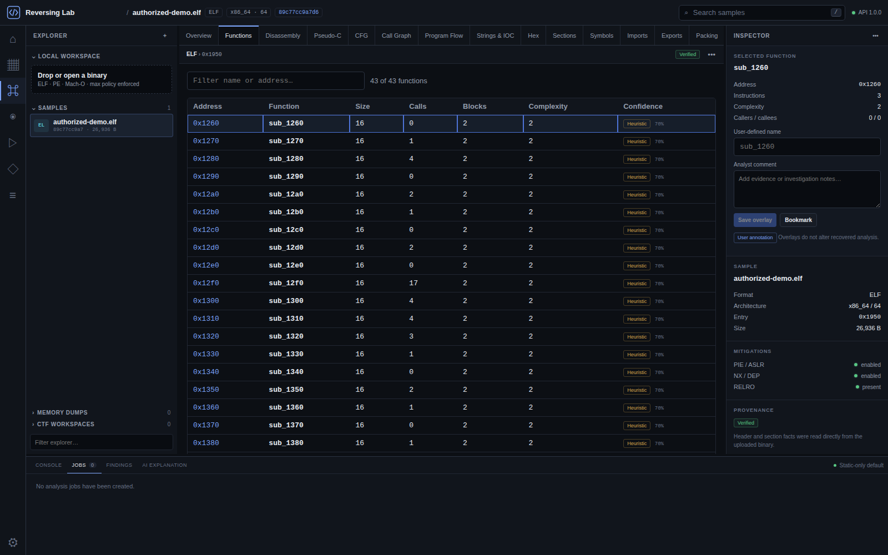 | 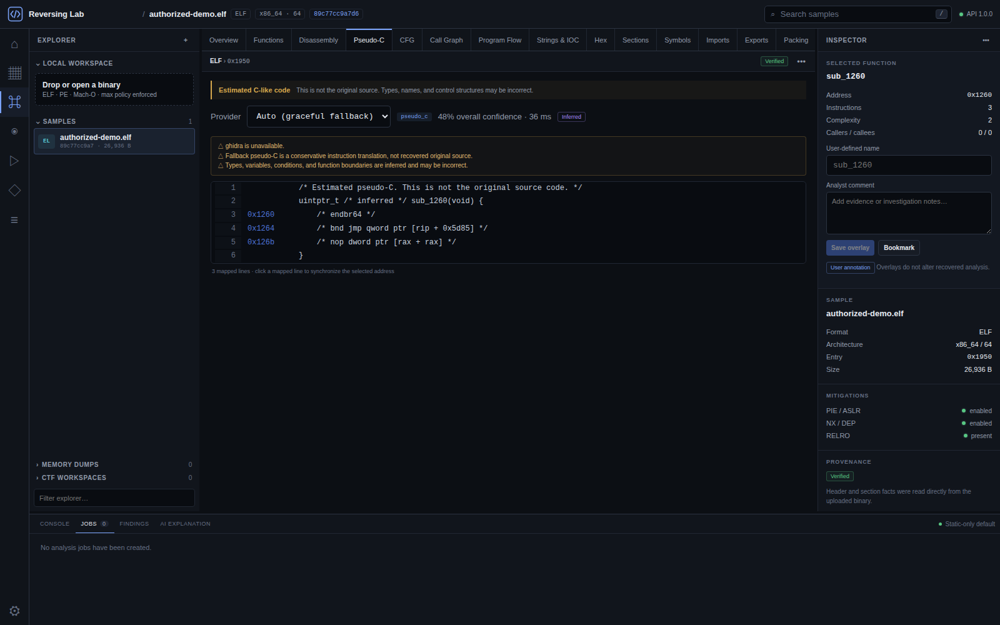 |

| Control Flow Graph | Call Graph |
|---|---|
| 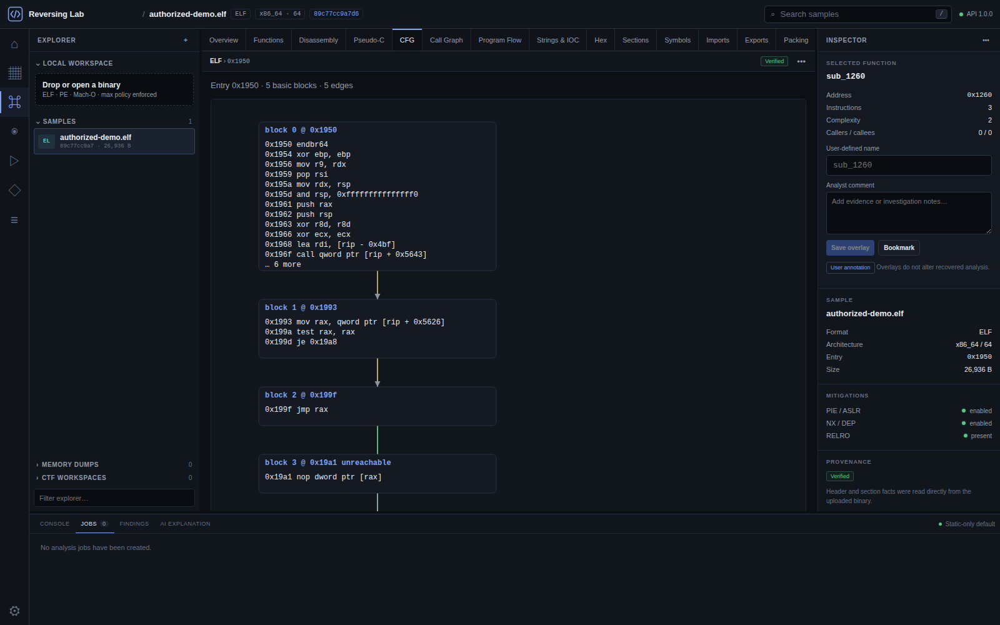 | 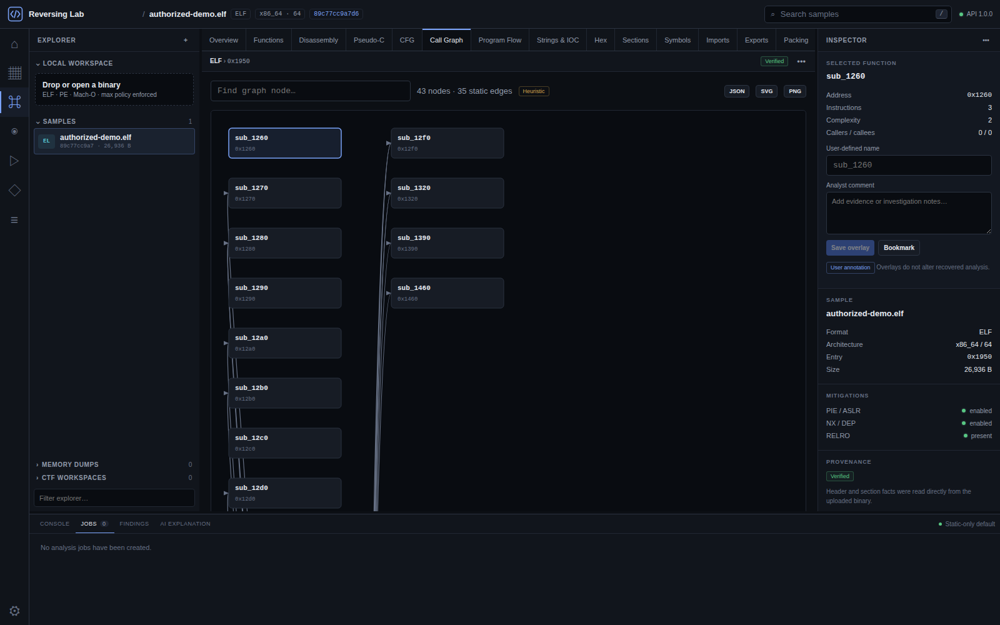 |

| Program Flow | 패킹·난독화 분석 |
|---|---|
| 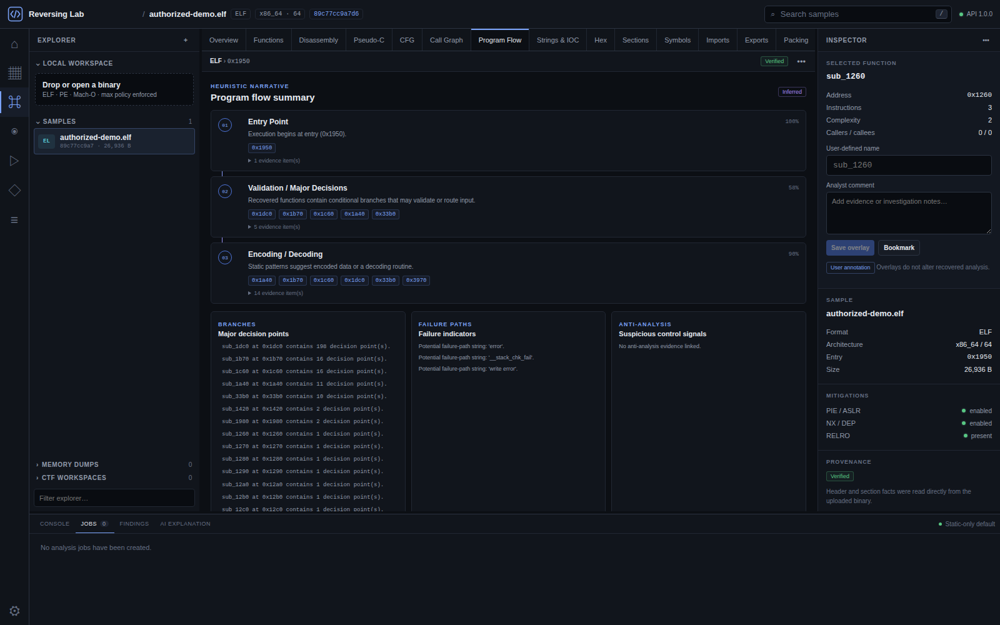 | 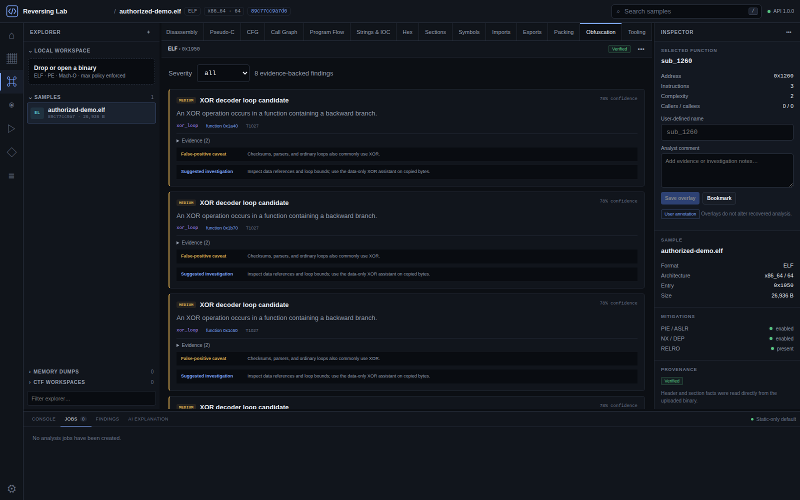 |

| 메모리 Region Inspector | 격리 실행 안전 게이트 |
|---|---|
| 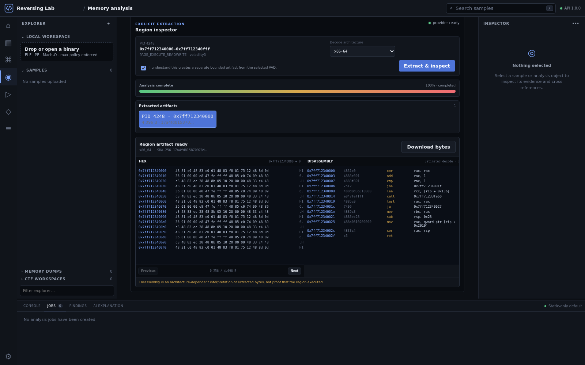 | 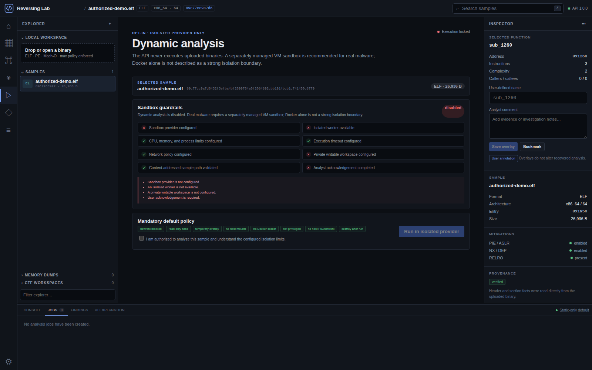 |

| CTF Workspace | 보고서 |
|---|---|
| 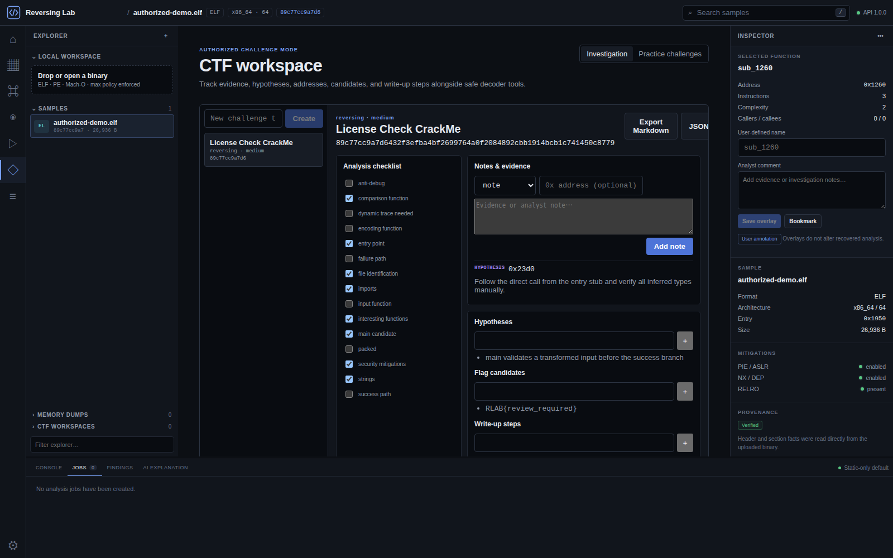 | 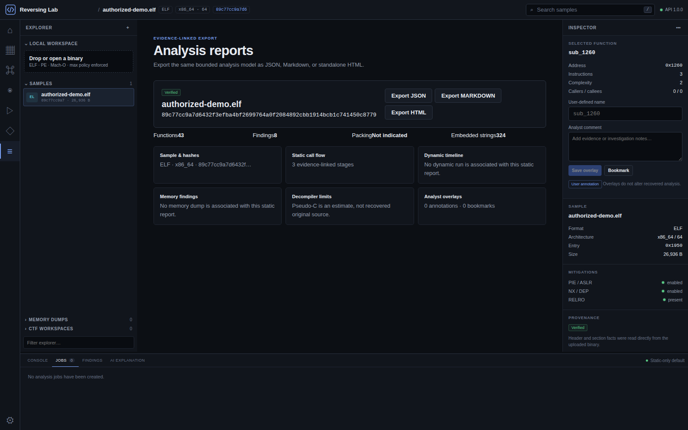 |

| 도구 및 설정 |
|---|
| 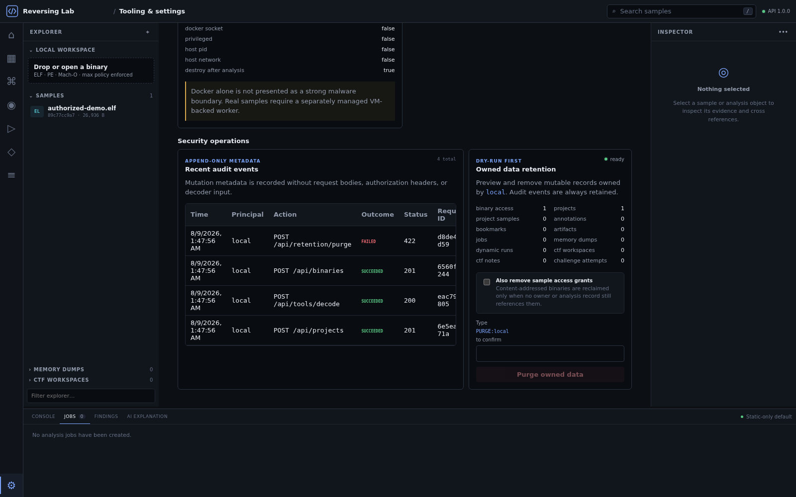 |

## 주요 기능

| 영역 | 기능 |
|---|---|
| 정적 분석 | metadata, mitigation, section, symbol, import/export, strings/IOC, hex, entropy |
| 함수 분석 | bounded function recovery, xref, disassembly, CFG, call graph, program flow |
| 디컴파일 | Ghidra headless adapter, 외부 도구가 없어도 동작하는 pseudo-C fallback |
| 탐지 | 근거·confidence가 포함된 패킹 및 난독화 finding, 명시적 UPX adapter |
| 악성코드 트리아지 | import 기반 capability 분류(ATT&CK 매핑), 문자열 IOC 추출, 위험 점수·판정, 선택적 Ghidra headless 호출부 확인 |
| 메모리 | data-only fallback, process/thread/command-line/DLL/handle/VAD/network 정규화, bounded VAD hex/disassembly |
| 동적 분석 | API와 분리된 provider 계약, 8개 guardrail, 기본 실행 차단 |
| 조사 지원 | annotation, bookmark, CTF checklist/note/hypothesis, 안전한 decoder playground |
| 저장·보고 | content-addressed storage, DB-backed jobs, JSON/Markdown/HTML export |
| 운영 | Alembic migration, API-key roles, owner scope, hash-chained JSONL audit export, dry-run retention |

## 로컬 개발 실행

권장 환경은 Python 3.11 이상과 Node 20.20 이상입니다. 백엔드는 Python 3.10도 CI에서
검증합니다.

터미널 1 — 백엔드:

```bash
git clone https://github.com/MintKangaroo/Reversing_Lab.git
cd Reversing_Lab
python3 -m venv .venv
source .venv/bin/activate
pip install -r backend/requirements.txt -r backend/requirements-dev.txt
cd backend
python -m reversing_lab.database.migrate
uvicorn reversing_lab.api.app:app --reload --port 8000
```

터미널 2 — 프런트엔드:

```bash
cd Reversing_Lab/frontend
npm ci
npm run dev
```

모든 설정은 `RLAB_` 환경변수로 덮어쓸 수 있습니다. 기본값은
[`backend/.env.example`](backend/.env.example)에 있습니다.

## 인증 설정 (선택)

로컬 호환성을 위해 인증은 기본적으로 꺼져 있습니다. 공유 환경에서는 API key 모드를
활성화하고 TLS reverse proxy와 rate limit를 함께 사용하십시오. 서버에는 원문 키가 아니라
SHA-256 digest만 설정하며, UI는 원문 키를 현재 탭 메모리에만 보관합니다.

```bash
cd backend
python - <<'PY'
import getpass, hashlib
print(hashlib.sha256(getpass.getpass("New API key: ").encode()).hexdigest())
PY

export RLAB_AUTH_MODE=api_key
export RLAB_AUTH_API_KEY_HASHES='{"<출력된 digest>":"analyst-one:analyst"}'
```

역할은 읽기 전용 `viewer`, 변경 가능한 `analyst`, 전체 프로젝트를 감사할 수 있는 `admin`입니다.
인증 모드에서는 binary grant와 annotation/bookmark/dump/run/job/CTF owner scope가 적용되며,
권한이 없는 리소스는 404로 응답합니다. 동일 바이너리를 다른 사용자가 직접 다시 업로드하면
물리 파일은 hash로 deduplicate하고 해당 사용자에게 별도 access grant와 표시 파일명을 만듭니다.
admin은 운영 감사를 위해 전체 리소스를 볼 수 있습니다.
[인증 문서](docs/AUTHENTICATION.md)에 운영 및 rotation 절차가 있습니다.

모든 변경 요청에는 서버 생성 `X-Request-ID`가 붙고 method, route template, status, principal,
resource 식별자만 감사 이벤트로 저장됩니다. 요청 본문, bearer key와 decoder 입력은 저장하지
않습니다. `Settings`의 데이터 정리는 현재 principal 소유 데이터만 대상으로 하며, 먼저 수량과
예상 회수 용량을 보여줍니다. 실행에는 정확한 `PURGE:<principal-id>` 입력이 필요하고 실행 중인
job이 있으면 차단됩니다. Binary access grant를 함께 지워도 다른 참조가 남은 hash 파일은
보존됩니다.

감사 export는 manifest, 오래된 순서의 event, completeness footer로 구성되며 export 시점에
SHA-256 hash chain을 계산합니다. 외부 archive로 옮긴 뒤 파일 내부 변조·누락을 확인하는
보조 수단이며, 원본 DB가 변조되지 않았다는 증명이나 외부 신뢰 anchor는 아닙니다.

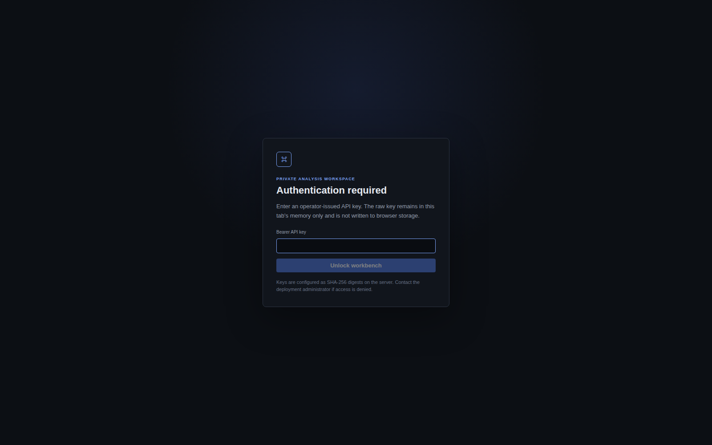

## 외부 도구

모두 선택 사항이며, 설치되지 않은 도구는 해당 기능만 비활성화됩니다.

| 도구 | 설정 | 사용처 |
|---|---|---|
| Ghidra | `GHIDRA_HOME=/opt/ghidra` | 함수 단위 headless decompile, 악성코드 트리아지 의심 호출부 확인 |
| UPX | `RLAB_UPX_PATH=upx` | 사용자 확인 후 별도 unpacked artifact 생성 |
| Volatility 3 | `RLAB_VOLATILITY_PATH=vol` | process/thread/command-line/module/handle/VAD/network 정규화와 명시적 VAD 추출 |
| radare2 | `RLAB_RADARE2_PATH=r2` | 선택적 whole-binary 분석 |
| Binary Ninja | 라이선스된 Python module | 가용성 및 선택적 adapter |

외부 명령은 고정 argument vector, `shell=False`, timeout, 출력 상한, 제한된 환경과 임시
작업 공간을 사용합니다.

## 동적 분석 안전 경계

동적 분석 기본값은 `RLAB_SANDBOX_PROVIDER=disabled`입니다. provider, 격리 worker,
resource limit, timeout, network policy, private workspace, 검증된 sample path, 사용자 확인이
모두 충족되어야 실행 버튼과 API가 활성화됩니다.

FastAPI 프로세스는 업로드 바이너리를 직접 실행하지 않습니다. Docker만으로 강한 악성코드
격리를 보장하지 않으며, 실전 샘플은 별도 네트워크의 폐기 가능한 VM provider가 필요합니다.
자세한 내용은 [동적 분석 문서](docs/DYNAMIC_ANALYSIS.md)를 참고하십시오.

## 아키텍처

```text
React Analysis Workbench
          │ HTTP / SSE
          ▼
FastAPI API ── optional auth / SQLAlchemy metadata
    ├── parser / static analysis / functions / graphs
    ├── decompiler / packing / obfuscation adapters
    ├── DB-backed jobs ── memory / dynamic provider control plane
    └── content-addressed samples and compressed artifacts
```

SQLite는 기본 개발 데이터베이스이며 Alembic이 schema를 관리합니다. PostgreSQL 16도 migration
왕복과 64비트 주소·크기 repository 계약을 CI에서 검증합니다. PostgreSQL을 사용할 때는
`pip install -r backend/requirements-postgres.txt` 후 `RLAB_DATABASE_URL`을
`postgresql+psycopg://...` 형식으로 설정하십시오. 대용량 결과는 압축 artifact로 저장하고
DB에는 index와 metadata만 보관합니다.

## 테스트

```bash
cd backend && ../.venv/bin/pytest
cd ../frontend && npm test && npm run build && npm audit --audit-level=high
```

현재 기준은 SQLite backend 129개와 PostgreSQL 전용 계약 1개 skip, frontend 21개 테스트 통과,
production build 성공, npm 취약점 0건입니다. 테스트 fixture에는 실제 악성코드가 포함되지
않습니다. CI는 Python 3.10/3.11, PostgreSQL 16 migration 왕복, frontend build/audit,
Alembic drift와 whitespace를 검사합니다.

## 현재 제한

- 실제 VM sandbox provider와 RetDec/r2ghidra adapter는 아직 구현되지 않았습니다.
- Volatility 분석은 Windows full dump와 x86/x86-64에 한정되고, VAD 추출은 정규화된 전체
  VAD와 기본 1 MiB 상한만 지원합니다. environment variable, registry, YARA와 임의 부분 범위
  추출은 아직 지원하지 않습니다.
- 함수 경계, 타입, indirect control flow, pseudo-C는 휴리스틱이므로 수동 검증이 필요합니다.
- PostgreSQL 운영 배포의 backup/restore·HA·부하 검증과 OIDC, server-side rate limiting이
  추가로 필요합니다.
- 내장 감사 이벤트는 애플리케이션 수준 append-only metadata입니다. 변조 방지 서명, 외부
  WORM 보관소 전송, 장기 archive/rotation 정책은 운영 환경에서 별도로 구성해야 합니다.

## 문서와 로드맵

- [API](docs/API.md) · [Architecture](docs/ARCHITECTURE.md) · [Development](docs/DEVELOPMENT.md)
- [Audit logging](docs/AUDIT_LOGGING.md)
- [Security](docs/SECURITY.md) · [Threat model](docs/THREAT_MODEL.md) · [Authentication](docs/AUTHENTICATION.md)
- [Decompilation](docs/DECOMPILATION.md) · [Memory](docs/MEMORY_ANALYSIS.md) · [Dynamic](docs/DYNAMIC_ANALYSIS.md)
- [Roadmap](docs/ROADMAP.md) · [Implementation record](docs/IMPLEMENTATION_PLAN.md)

## 라이선스

MIT License. [LICENSE](LICENSE)를 참고하십시오.
