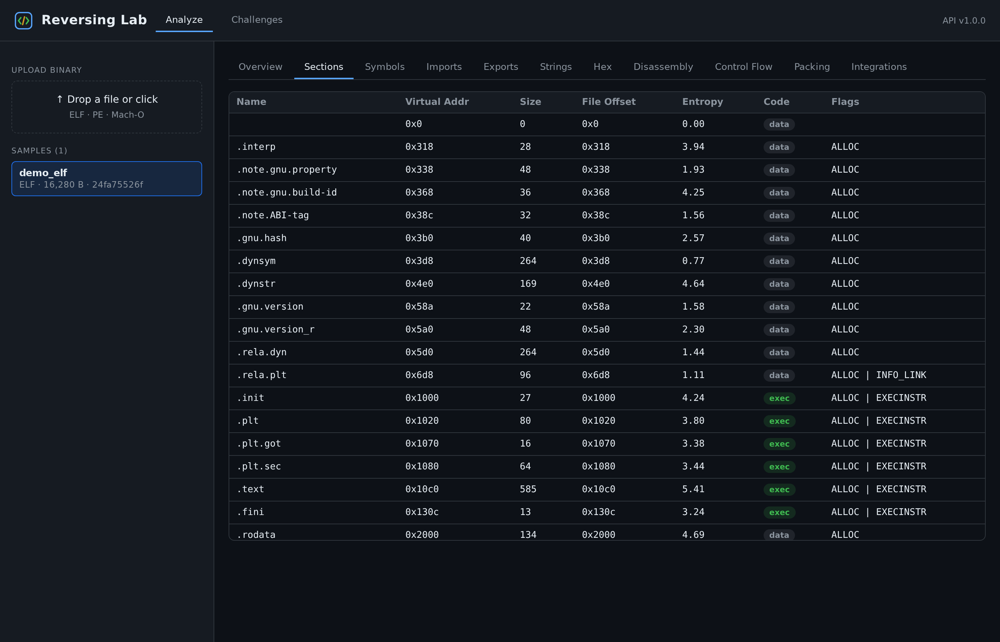
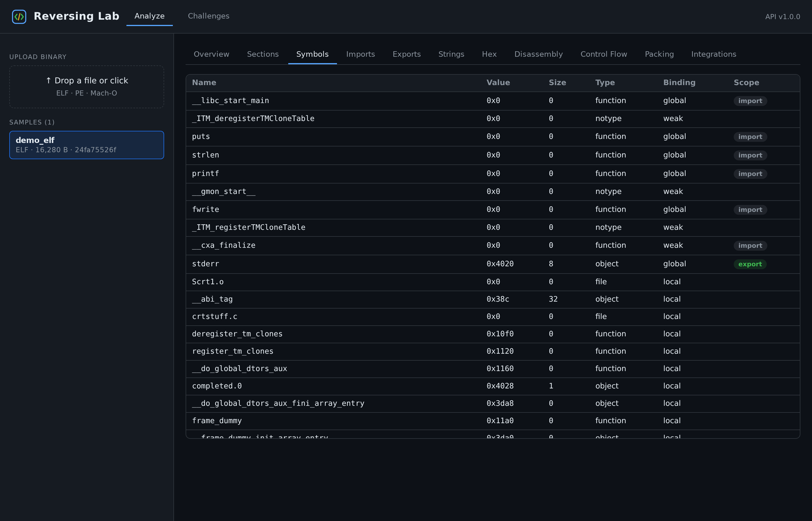
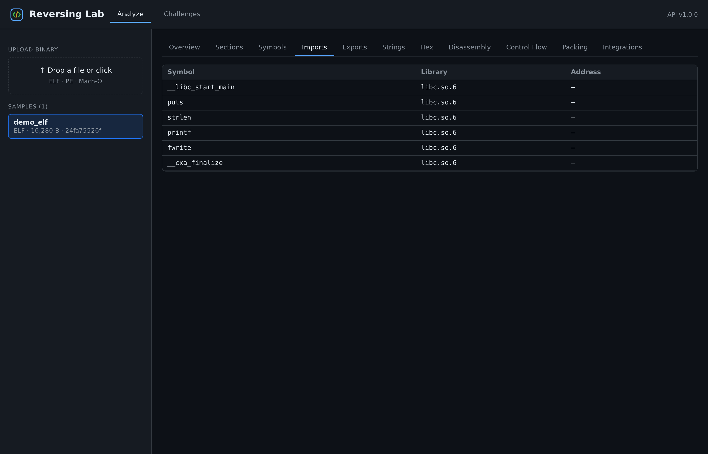
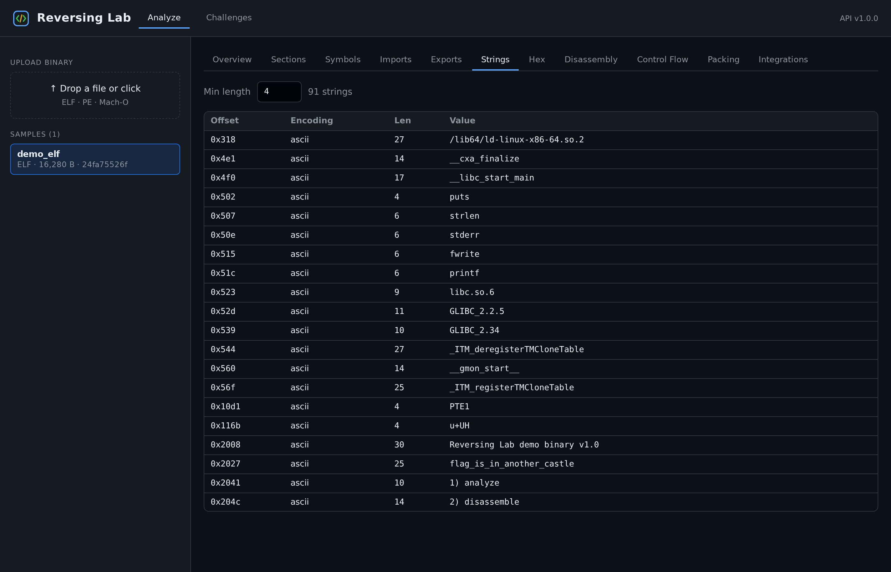
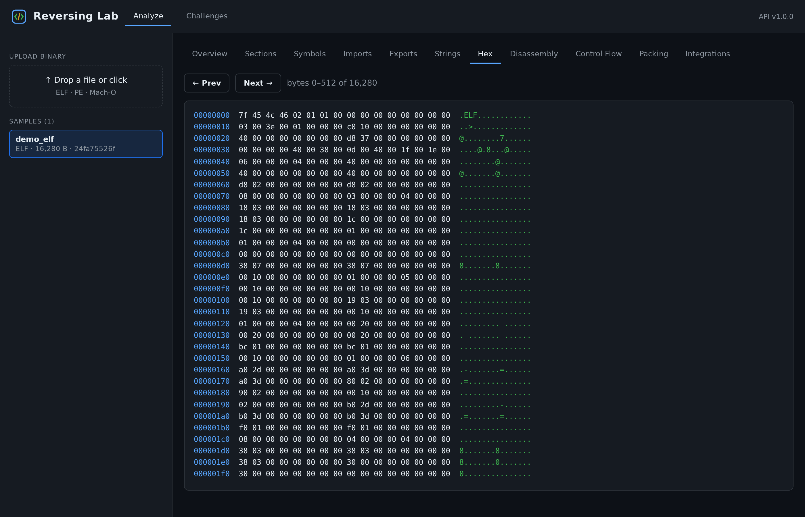
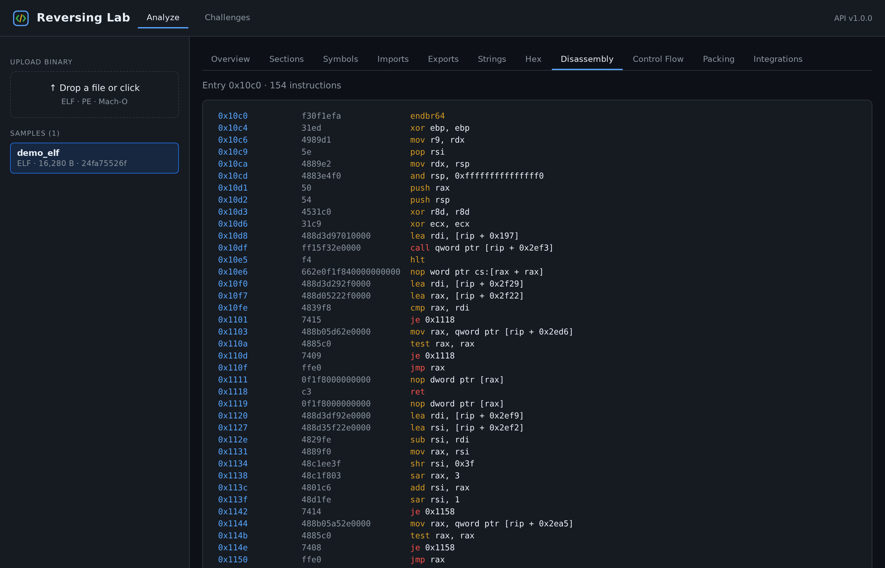
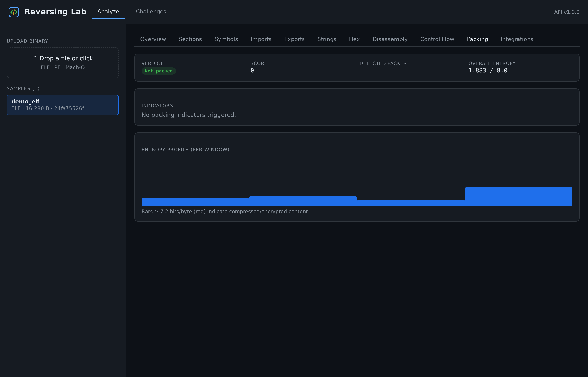
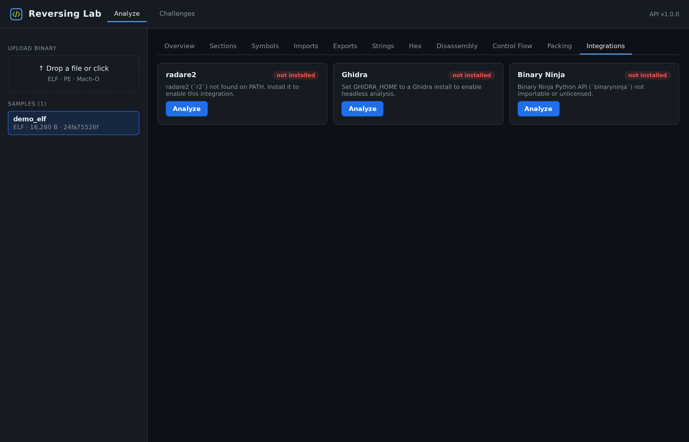
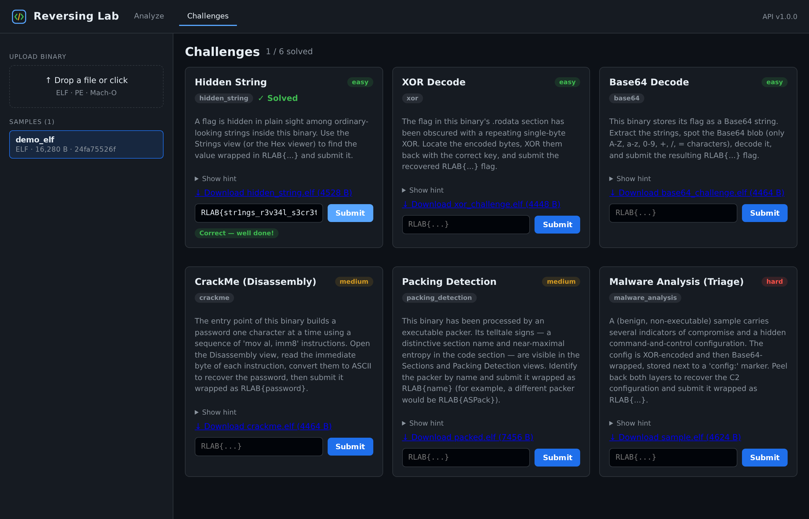

<div align="center">

# 🔬 Reversing Lab

**리버스 엔지니어링 학습용 웹 플랫폼**
바이너리를 업로드하고 헤더 · 섹션 · 심볼 · 임포트/익스포트 · 문자열 · Hex · 디스어셈블리 ·
컨트롤 플로우 그래프까지 모든 층위를 들여다보며, 실습 문제로 실력을 다집니다.

**ELF · PE · Mach-O** 를 지원합니다. 타입이 명시되고 테스트된 Python 분석 코어
(Capstone · LIEF · pyelftools · pefile)를 FastAPI 서비스로 감싸고, React 프런트엔드를 얹었습니다.


</div>

---

## 목차

- [스크린샷](#스크린샷)
- [주요 기능](#주요-기능)
- [아키텍처](#아키텍처)
- [프로젝트 구조](#프로젝트-구조)
- [시작하기](#시작하기)
- [API 레퍼런스](#api-레퍼런스)
- [실습 문제](#실습-문제)
- [외부 도구 연동](#외부-도구-연동)
- [테스트](#테스트)
- [보안 설계](#보안-설계)
- [한계와 로드맵](#한계와-로드맵)
- [라이선스](#라이선스)

---

## 스크린샷

### 바이너리 개요 — 포맷, 아키텍처, 보안 완화 기법
헤더의 핵심 정보와 완화 기법 플래그(PIE/ASLR, NX, RELRO)를 한눈에 보여주고,
포맷별 고유 메타데이터도 함께 제공합니다.


### 섹션 & 심볼
섹션별 가상 주소, 크기, 파일 오프셋, **엔트로피**, 읽기/쓰기/실행 플래그와,
타입·바인딩·임포트/익스포트 범위를 담은 전체 심볼 테이블을 보여줍니다.




### 임포트 & 문자열
라이브러리별로 귀속된 임포트 심볼과, 파일 오프셋·인코딩을 함께 표시하는
ASCII/UTF-16LE 문자열 추출 결과입니다.




### Hex 뷰어
`오프셋 | hex | ascii` 형태의 페이지 단위 덤프로, 한 번에 한 페이지씩만 전송하므로
수 MB 파일도 통째로 내려받을 필요가 없습니다.



### 디스어셈블리
Capstone 기반의 선형 디스어셈블리에 구문 강조를 입혔습니다. 제어 흐름 명령어
(`jmp`, `je`, `call`, `ret`)는 색으로 구분되어 분기가 눈에 잘 띕니다.



### 컨트롤 플로우 그래프
고전적인 leader 알고리즘으로 복원한 기본 블록을 인터랙티브 SVG로 배치합니다.
**초록색** 엣지는 분기(taken), **노란색** 엣지는 fall-through를 나타냅니다.


### 패킹 탐지
가중치 기반 휴리스틱(알려진 패커 섹션명, 고엔트로피 실행 섹션, 작은 임포트 테이블,
쓰기+실행 섹션)으로 근거가 명시된 판정과 윈도우별 엔트로피 프로파일을 산출합니다.
아래는 정상 바이너리와 UPX 형태로 패킹된 샘플의 비교입니다.




### 외부 도구 연동
radare2, Ghidra, Binary Ninja 어댑터가 설치 여부를 보고하고 필요할 때만 실행합니다.
도구가 없으면 요청을 중단하지 않고 우아하게 축소 동작합니다.



### 실습 문제
난이도 배지, 다운로드 가능한 **실제 바이너리** 아티팩트, 힌트, 그리고 서버측 정답 검증을
갖춘 6종의 실습 문제입니다.




---

## 주요 기능

### 지원 포맷
| 포맷 | 백엔드 | 비고 |
|--------|---------|-------|
| **ELF** | LIEF | 실행 파일 & 공유 객체. RELRO는 `GNU_RELRO` 세그먼트로 탐지 |
| **PE** | LIEF | PE32 / PE32+. DLL 특성 → PIE/NX. 임포트 & 익스포트 테이블 |
| **Mach-O** | LIEF | thin 단일 아키텍처 실행 파일 & dylib |

### 분석 뷰
`헤더` · `섹션` · `심볼` · `임포트` · `익스포트` · `문자열` · `Hex 뷰어`
· `디스어셈블리` · `컨트롤 플로우 그래프` · `패킹 탐지`

### 실습 문제 유형
`Hidden String` · `XOR` · `Base64` · `CrackMe` · `Packing Detection` · `Malware 분석`

### 내부 설계
- **정규화된 모델.** 모든 파서가 동일한 frozen 데이터클래스(`BinaryInfo`, `Section`,
  `Symbol` …)를 산출하므로, 하위 모듈은 특정 파싱 라이브러리에 의존하지 않습니다.
- **어디서나 상한 적용.** 업로드 크기, 명령어 개수, 문자열 개수, CFG 크기가 모두 제한되어
  악의적인 입력이 자원을 고갈시키지 못합니다.
- **정적 분석 전용.** 업로드된 바이너리는 **절대 실행하지 않으며**, 도착하는 순간부터
  적대적 데이터로 취급합니다.

---

## 아키텍처

백엔드는 프레임워크에 독립적인 순수 분석 라이브러리이고, 그 위에 얇은 FastAPI 레이어를
얹은 구조입니다. 의존성은 오직 한 방향, 즉 의존성 없는 데이터 모델 어휘를 향합니다:

```
 React UI  ──HTTP──▶  FastAPI (api/)
                          │
        ┌─────────────────┼──────────────────┬───────────────┐
        ▼                 ▼                  ▼               ▼
     parser/          analyzer/        disassembler/     challenge/      integrations/
   (LIEF 기반)      (문자열, hex,      (Capstone +       (6종 생성기,    (radare2, ghidra,
        │            엔트로피, 패킹)     CFG 빌더)         검증기)         binary ninja)
        ▼
   parser/models.py  ◀── 공유되는 의존성 없는 데이터클래스 ──▶  api/schemas.py
        │
        ▼
     database/  (SQLAlchemy 모델 · 리포지토리 · 세션)
```

전체 설계, 데이터 흐름, 각 핵심 결정의 근거는 [`docs/ARCHITECTURE.md`](docs/ARCHITECTURE.md)를
참고하세요.

---

## 프로젝트 구조

```
reversing_lab/
├── backend/
│   ├── reversing_lab/
│   │   ├── config.py            # pydantic 설정 (환경변수로 오버라이드 가능)
│   │   ├── logging_config.py    # 중앙 집중식 로깅
│   │   ├── errors.py            # 도메인 예외 계층
│   │   ├── parser/              # ELF/PE/Mach-O → 정규화된 BinaryInfo
│   │   ├── analyzer/            # 문자열, hexdump, 엔트로피, 패킹
│   │   ├── disassembler/        # Capstone 래퍼 + CFG 빌더
│   │   ├── challenge/           # 프레임워크 + 6종 생성기 + 레지스트리
│   │   ├── integrations/        # radare2 / ghidra / binary ninja 어댑터
│   │   ├── database/            # SQLAlchemy 모델, 세션, 리포지토리
│   │   └── api/                 # FastAPI 앱, 라우터, 스키마, DI
│   ├── tests/                   # 57개 테스트, 커버리지 ~92%
│   ├── pyproject.toml
│   └── requirements.txt
├── frontend/                    # React + Vite 싱글 페이지 앱
│   └── src/{api.js, App.jsx, components/}
└── docs/
    ├── ARCHITECTURE.md
    └── screenshots/
```

---

## 시작하기

### 사전 요구 사항
- Python **3.10+**
- Node **18+** (프런트엔드용)

### 1 · 백엔드

```bash
cd backend
python3 -m venv .venv && source .venv/bin/activate
pip install -r requirements.txt -r requirements-dev.txt

# API 실행 (최초 실행 시 ./reversing_lab.db 와 ./data/binaries 생성)
uvicorn reversing_lab.api.app:app --reload --port 8000
```

인터랙티브 API 문서는 **http://localhost:8000/docs** 에서 제공됩니다.

설정은 `RLAB_` 접두사가 붙은 환경변수로 조정합니다
([`config.py`](backend/reversing_lab/config.py) 참고). 예시:

```bash
export RLAB_MAX_UPLOAD_BYTES=67108864      # 64 MiB 업로드 상한
export RLAB_DATABASE_URL="sqlite:///./rlab.db"
export RLAB_CORS_ORIGINS='["http://localhost:5173"]'
```

### 2 · 프런트엔드

```bash
cd frontend
npm install
npm run dev      # http://localhost:5173  (/api → http://127.0.0.1:8000 프록시)
```

다른 백엔드를 바라보게 하려면 `VITE_API_TARGET=http://host:port npm run dev` 로 실행하세요.

프로덕션 빌드는 `npm run build` 로 하며 정적 자산이 `frontend/dist/` 에 생성됩니다.

---

## API 레퍼런스

모든 엔드포인트는 `/api` 하위에 있습니다. 바이너리는 **SHA-256** 으로 식별됩니다.

| 메서드 | 경로 | 설명 |
|--------|------|-------------|
| `GET`  | `/health` | 헬스체크 + 버전 |
| `POST` | `/binaries` | 바이너리 업로드(multipart `file`); `sha256` 반환 |
| `GET`  | `/binaries` | 업로드된 바이너리 목록 |
| `GET`  | `/binaries/{sha}/info` | 헤더, 섹션, 심볼, 임포트, 익스포트 |
| `GET`  | `/binaries/{sha}/strings?min_length=&limit=` | 추출된 문자열 |
| `GET`  | `/binaries/{sha}/hex?offset=&length=` | 페이지 단위 hex 덤프 |
| `GET`  | `/binaries/{sha}/entropy?window=` | 전체 + 윈도우별 엔트로피 |
| `GET`  | `/binaries/{sha}/packing` | 근거가 포함된 패킹 판정 |
| `GET`  | `/binaries/{sha}/disassembly?address=&count=` | 선형 디스어셈블리 |
| `GET`  | `/binaries/{sha}/cfg?address=` | 컨트롤 플로우 그래프 |
| `POST` | `/binaries/{sha}/integrations/{name}` | 외부 도구 실행 |
| `GET`  | `/integrations` | radare2 / Ghidra / Binary Ninja 가용성 |
| `GET`  | `/challenges` | 문제 목록(메타데이터만) |
| `GET`  | `/challenges/{slug}/artifact` | 문제 바이너리 다운로드 |
| `POST` | `/challenges/{slug}/submit` | 정답 검증(`{"answer": "RLAB{...}"}`) |

도메인 오류는 정확한 상태 코드로 매핑됩니다: `415` 미지원 포맷, `404` 미존재,
`422` 파싱/디스어셈블리 실패, `503` 연동 도구 미가용.

예시:

```bash
# 업로드 후 분석
SHA=$(curl -s -F file=@/bin/ls http://localhost:8000/api/binaries | jq -r .sha256)
curl -s http://localhost:8000/api/binaries/$SHA/info | jq '{format:.binary_format, arch:.architecture, sections:(.sections|length)}'
curl -s "http://localhost:8000/api/binaries/$SHA/packing" | jq '{packed:.likely_packed, score, packer:.detected_packer}'
```

---

## 실습 문제

모든 문제는 플랫폼이 제공하는 바로 그 도구로 분석하는 **실제 ELF 바이너리**를 함께 제공하며,
정답은 `RLAB{...}` 형태의 플래그입니다. 서버에서 상수 시간 비교로 검증하므로
정답이 클라이언트로 노출되지 않습니다.

| Slug | 제목 | 난이도 | 연습하는 기술 |
|------|-------|-----------|-----------------|
| `hidden-string` | Hidden String | easy | 문자열 / Hex |
| `xor-decode` | XOR Decode | easy | 단일 바이트 XOR |
| `base64-decode` | Base64 Decode | easy | 문자열 + Base64 |
| `crackme-disasm` | CrackMe | medium | 디스어셈블리 판독 |
| `packing-detection` | Packing Detection | medium | 엔트로피 & 섹션 |
| `malware-triage` | Malware 분석 | hard | 문자열 + Base64 + XOR (다층 IOC 복원) |

> malware-triage 샘플은 의도적으로 **무해하며 실행 불가능**합니다 — 지표와 인코딩된 C2 설정을
> *포함할* 뿐입니다. 모든 분석은 정적으로 이뤄집니다.

---

## 외부 도구 연동

세 가지 연동은 선택 사항이며 런타임에 탐지됩니다. API는 각 도구의 가용성을 보고하고
설치된 도구만 실행합니다.

| 도구 | 활성화 조건 | 반환 내용 |
|------|--------------|-----------------|
| **radare2** | `r2` 가 `PATH` 에 존재 | `aa; aflj` 로 얻은 함수 목록 |
| **Ghidra** | `GHIDRA_HOME` 이 설치 경로를 가리킴 | 헤드리스 자동 분석 요약 |
| **Binary Ninja** | 라이선스된 `binaryninja` 모듈 임포트 가능 | 복원된 함수 이름 |

연동은 **고정된 인자 벡터**로 실행하며(`shell=True` 사용 안 함) 타임아웃을 두고, 서버가
관리하는 content-hash 파일 경로에만 동작합니다.

---

## 테스트

```bash
cd backend
pytest                      # 57개 테스트
pytest --cov=reversing_lab  # 커버리지 포함 (~92%)
```

테스트 스위트는 실행 시점에 최소한의 유효한 ELF/PE/Mach-O 픽스처를 합성하고(불투명한 blob을
저장소에 넣지 않음), 모든 analyzer와 disassembler/CFG를 검증하며, 6종 문제를 왕복 테스트하고
(생성 → 프로그램적으로 풀이 → 검증이 의도된 정답은 통과시키고 오답은 거부하는지 확인),
FastAPI `TestClient`로 API를 계약 테스트합니다.

---

## 보안 설계

- 업로드된 바이너리를 **절대 실행하지 않음** — 정적 분석 전용.
- **업로드 크기** 상한(`RLAB_MAX_UPLOAD_BYTES`) 및 무거운 파싱 전에 **포맷 허용 목록** 검사.
- **분석 상한:** 디스어셈블리, CFG, 문자열, hex 연산에 모두 강한 제한 적용.
- **경로 조작 불가:** 저장 파일은 content hash로 명명되어 사용자 입력이 파일 경로에 닿지 않음.
- **견고한 파싱:** 라이브러리 오류를 타입이 명시된 `ParseError`로 변환 — 손상된 샘플은
  응답을 축소시킬 뿐 서비스를 중단시키지 않음.
- **문제 정답**은 `hmac.compare_digest`로 서버측에서 검증하며 클라이언트로 직렬화하지 않음.

> **개발 서버 참고:** 프런트엔드의 Vite 5 툴체인은 로컬 개발 서버에만 영향을 주는 esbuild
> 권고사항을 포함합니다(프로덕션 `dist/` 빌드에는 영향 없음). Vite 8 업그레이드는 breaking
> change라 의도적으로 보류했습니다.

---

## 한계와 로드맵

- 디스어셈블리/CFG는 **x86/x86-64**에서 가장 강력합니다. ARM/MIPS/PPC도 디코딩되지만
  CFG 함수 범위 휴리스틱은 x86에 맞춰 튜닝되어 있습니다.
- CFG 복원은 프로시저 내부(intraprocedural)이며 **직접** 분기를 따릅니다. 간접 점프는
  정적 타깃 없이 종료 지점으로 기록됩니다.
- Mach-O **fat/universal** 바이너리는 탐지되지만 thin 슬라이스만 완전히 모델링됩니다.
- 예정: 멀티 아키텍처 CFG 개선, 심볼 디맹글링, 사용자별 지속 문제 스코어보드.

---

## 라이선스

MIT © MintKangaroo — [`LICENSE`](LICENSE) 참고.
