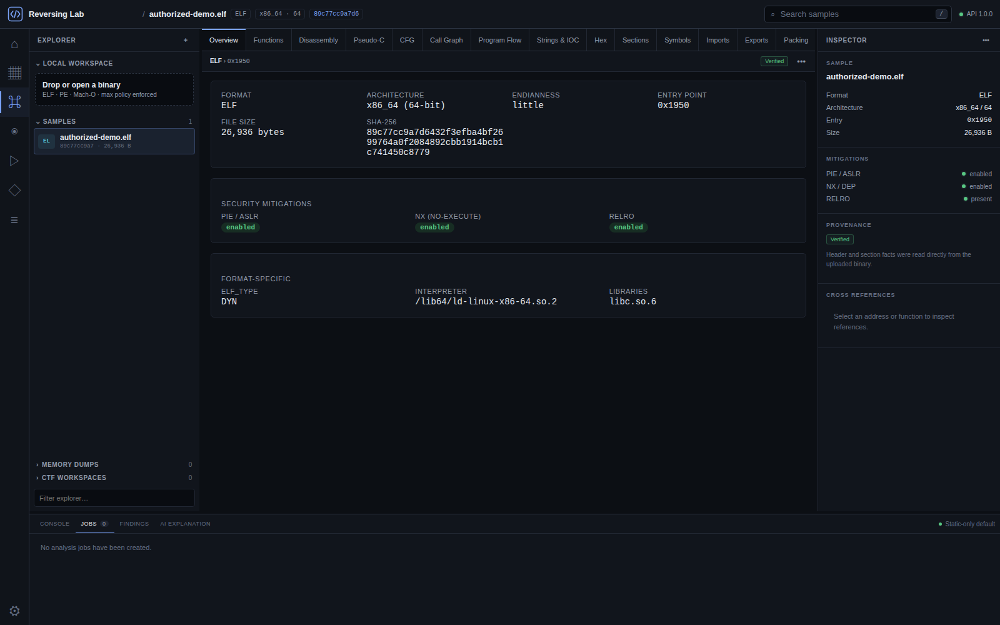
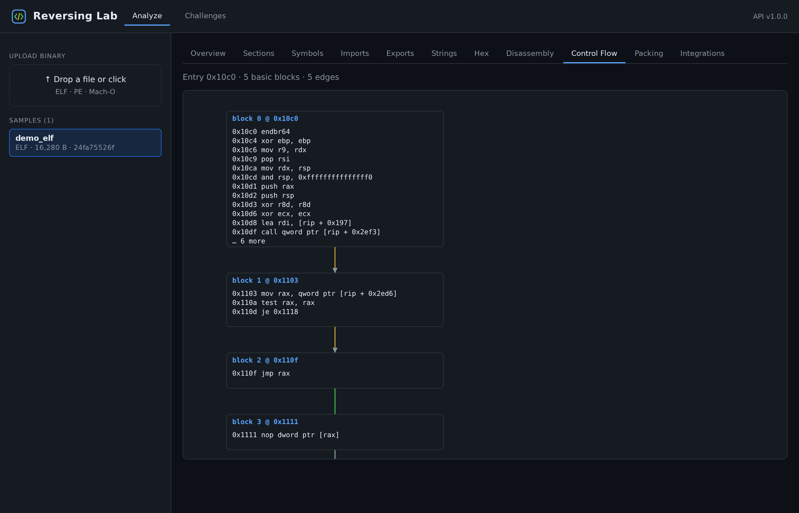
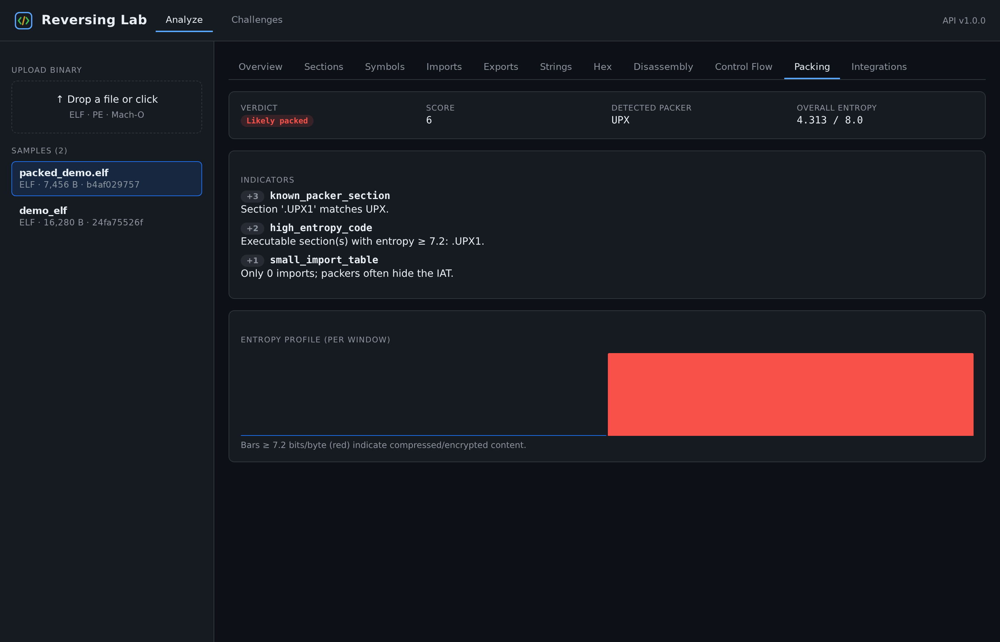
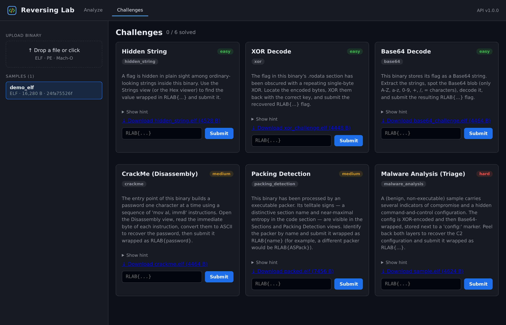

# Reversing Lab

Reversing Lab은 권한을 보유한 바이너리, CTF/CrackMe, 안전한 교육용 샘플을 분석하기 위한
웹 기반 리버스 엔지니어링 워크벤치입니다. React 분석 UI와 FastAPI 분석 코어가 ELF, PE,
Mach-O 정적 분석, 함수/CFG/call graph, 추정 pseudo-C, 패킹·난독화 finding, 메모리 트리아지,
격리형 동적 분석 제어면, CTF 노트, 보고서 export를 하나의 증거 기반 모델로 연결합니다.

> 이 프로젝트는 승인받지 않은 침해, 자격 증명 탈취, 악성코드 배포, DRM 우회 자동화,
> 실제 서비스 공격을 위한 도구가 아닙니다. 분석 권한이 있는 샘플에만 사용하십시오.


## 주요 화면

현재 워크벤치는 차콜/슬레이트 테마의 project explorer, 탭형 분석 공간, inspector,
jobs/findings 패널로 구성되며 키보드로 패널 크기와 주요 화면을 조작할 수 있습니다.
저장소에 포함된 아래 이미지는 분석 기능의 예시입니다.

| Binary overview | CFG |
|---|---|
|  |  |

| Packing evidence | Practice challenge |
|---|---|
|  |  |

## 구현된 기능

- content-addressed 업로드, ELF/PE/Mach-O 정규화 파싱, 섹션/심볼/import/export/문자열/hex
- 제한된 함수 복원, xref, 디스어셈블리, typed CFG, dominator/loop 표시, static call graph
- Ghidra headless adapter와 외부 도구가 없어도 동작하는 보수적 pseudo-C fallback
- 근거·confidence·provenance·false-positive caveat가 포함된 패킹/난독화 finding
- 데이터만 변환하는 Hex/Base64/XOR/ADD/SUB/ROL/ROR/ROT/endian/hash/checksum 도구
- DB-backed job 상태/진행/취소/SSE, content-addressed 압축 결과 artifact
- 기본 메모리 트리아지와 allowlist 기반 Volatility 3 adapter
- disabled-by-default 동적 분석 provider, 8개 guardrail readiness gate, mock orchestration provider
- CTF investigation workspace, 체크리스트, 노트/주소/가설/flag 후보, write-up export
- JSON/Markdown/HTML 정적 분석 보고서
- SQLite 개발 지원과 SQLAlchemy repository 경계

기능의 정확한 구현/제한 표는 [구현 계획](docs/IMPLEMENTATION_PLAN.md)과
[로드맵](docs/ROADMAP.md)을 참고하십시오.

## 아키텍처

```text
React Analysis Workbench
          │ HTTP / SSE
          ▼
FastAPI API ── SQLAlchemy indexes/metadata
    │
    ├── parser / static analysis / functions / CFG / call graph
    ├── decompiler adapters ── Ghidra | conservative pseudo-C
    ├── packing / obfuscation / safe data transforms
    ├── DB-backed jobs ── memory adapter / dynamic provider control plane
    └── content-addressed samples and compressed artifacts
```

FastAPI 프로세스는 업로드 바이너리를 직접 실행하지 않습니다. 동적 분석 API는 모든
guardrail이 충족된 별도 provider만 호출하며 기본값은 `disabled`입니다. 현재 `mock`
provider도 제어 흐름만 검증하고 샘플을 실행하지 않습니다.

자세한 설계는 [ARCHITECTURE](docs/ARCHITECTURE.md), [SECURITY](docs/SECURITY.md),
[THREAT MODEL](docs/THREAT_MODEL.md)을 읽으십시오.

## 설치 및 실행

권장 환경은 Python 3.11 이상과 Node 20.20 이상입니다. 백엔드는 Python 3.10도 지원합니다.

```bash
git clone https://github.com/MintKangaroo/Reversing_Lab.git
cd Reversing_Lab

cd backend
python3 -m venv .venv
source .venv/bin/activate
pip install -r requirements.txt -r requirements-dev.txt
uvicorn reversing_lab.api.app:app --reload --port 8000
```

다른 터미널에서:

```bash
cd frontend
npm ci
npm run dev
```

- UI: http://127.0.0.1:5173
- OpenAPI: http://127.0.0.1:8000/docs
- API health: http://127.0.0.1:8000/api/health

Docker 기반 개발 환경은 다음과 같이 시작할 수 있습니다.

```bash
docker compose up --build
```

이 compose 구성은 개발 편의용이며 악성코드 실행 sandbox가 아닙니다.

## 기본 사용 흐름

1. 분석 권한이 있는 안전한 fixture 또는 바이너리를 업로드합니다.
2. 함수 목록에서 함수를 선택하고 disassembly/pseudo-C/CFG를 함께 검토합니다.
3. call graph, program flow, packing/obfuscation finding의 주소와 근거를 교차 확인합니다.
4. 이름, 코멘트, bookmark를 analyst overlay로 저장합니다.
5. CTF workspace에 가설과 풀이 단계를 기록하거나 보고서를 export합니다.
6. 메모리 분석은 별도 dump만 업로드합니다.
7. 동적 분석은 VM-backed provider를 별도로 구현·구성하기 전까지 비활성 상태로 유지합니다.

## 외부 도구

모두 선택 사항입니다. 설치되지 않은 도구 하나 때문에 API 전체가 실패하지 않습니다.

| 도구 | 설정 | 현재 사용 |
|---|---|---|
| Ghidra | `GHIDRA_HOME=/opt/ghidra` | 함수 단위 headless decompile |
| UPX | `RLAB_UPX_PATH=upx` | 사용자가 명시한 UPX `-d`, 별도 artifact |
| Volatility 3 | `RLAB_VOLATILITY_PATH=vol` | 서버 allowlist plugin |
| radare2 | `RLAB_RADARE2_PATH=r2` | 선택적 전체 바이너리 분석 |
| Binary Ninja | 라이선스된 Python 모듈 | 가용성/선택적 adapter |

Ghidra/UPX/Volatility subprocess는 고정 argument vector, `shell=False`, timeout, 제한된 출력,
임시 작업 공간을 사용합니다. 자세한 설정은 [DECOMPILATION](docs/DECOMPILATION.md)과
[MEMORY ANALYSIS](docs/MEMORY_ANALYSIS.md)을 참고하십시오.

## 동적 분석 보안 경고

`RLAB_SANDBOX_PROVIDER=disabled`가 기본값입니다. provider, 격리 worker, CPU/메모리/프로세스
상한, timeout, network policy, private workspace, 검증된 sample path, 사용자 확인 중 하나라도
빠지면 실행 버튼과 API 실행이 모두 차단됩니다.

Docker 컨테이너만으로 강한 악성코드 격리를 보장하지 않습니다. 실전 악성 샘플에는 별도
네트워크 구역과 폐기 가능한 VM을 사용하는 provider가 필요합니다.
[DYNAMIC ANALYSIS](docs/DYNAMIC_ANALYSIS.md)에 provider 계약과 체크리스트가 있습니다.

## 테스트

```bash
cd backend
../.venv/bin/pytest

cd ../frontend
npm test
npm run build
npm audit
```

현재 검증 기준은 백엔드 94개, 프런트엔드 7개 테스트 통과와 프로덕션 빌드 성공입니다.
fixture는 테스트 시 생성하는 무해한 최소 ELF/PE/Mach-O 또는 데이터 버퍼이며 실제 악성코드를
포함하지 않습니다. CI 명령은 [.github/workflows/ci.yml](.github/workflows/ci.yml)에 있습니다.

## 설정

모든 런타임 설정은 `RLAB_` 환경변수로 덮어쓸 수 있습니다.
[`backend/.env.example`](backend/.env.example)을 복사해 사용하십시오. 주요 상한:

```bash
RLAB_MAX_UPLOAD_BYTES=33554432
RLAB_MAX_MEMORY_DUMP_BYTES=536870912
RLAB_MAX_FUNCTIONS=5000
RLAB_MAX_DYNAMIC_EVENTS=100000
RLAB_MAX_ANALYSIS_SECONDS=300
RLAB_MAX_CONCURRENT_JOBS=2
```

설정 화면과 `GET /api/tooling/configuration`은 비밀값이나 로컬 storage path를 노출하지 않고
유효한 상한과 sandbox 정책만 보여줍니다.

## 문서

- [API](docs/API.md)
- [Architecture](docs/ARCHITECTURE.md)
- [Security](docs/SECURITY.md)
- [Threat model](docs/THREAT_MODEL.md)
- [Dynamic analysis](docs/DYNAMIC_ANALYSIS.md)
- [Memory analysis](docs/MEMORY_ANALYSIS.md)
- [Decompilation](docs/DECOMPILATION.md)
- [Development](docs/DEVELOPMENT.md)
- [Roadmap](docs/ROADMAP.md)

## 알려진 제한

- RetDec/r2ghidra adapter와 실제 VM sandbox provider는 아직 구현되지 않았습니다.
- Volatility 결과 정규화는 현재 process list 중심이며 module/handle/registry/network plugin
  모델은 확장 예정입니다.
- 함수 경계, 타입, indirect call/jump, pseudo-C는 휴리스틱이므로 완전하지 않습니다.
- static report schema는 아직 동적 run과 memory dump를 binary sample에 자동 연결하지 않습니다.
- SQLite 스키마는 개발 환경에서 `create_all`로 추가되며 Alembic migration은 아직 없습니다.
- 인증/RBAC/다중 사용자 격리는 아직 없으므로 인터넷에 직접 노출하면 안 됩니다.

## 라이선스

MIT License. [LICENSE](LICENSE)를 참고하십시오.
